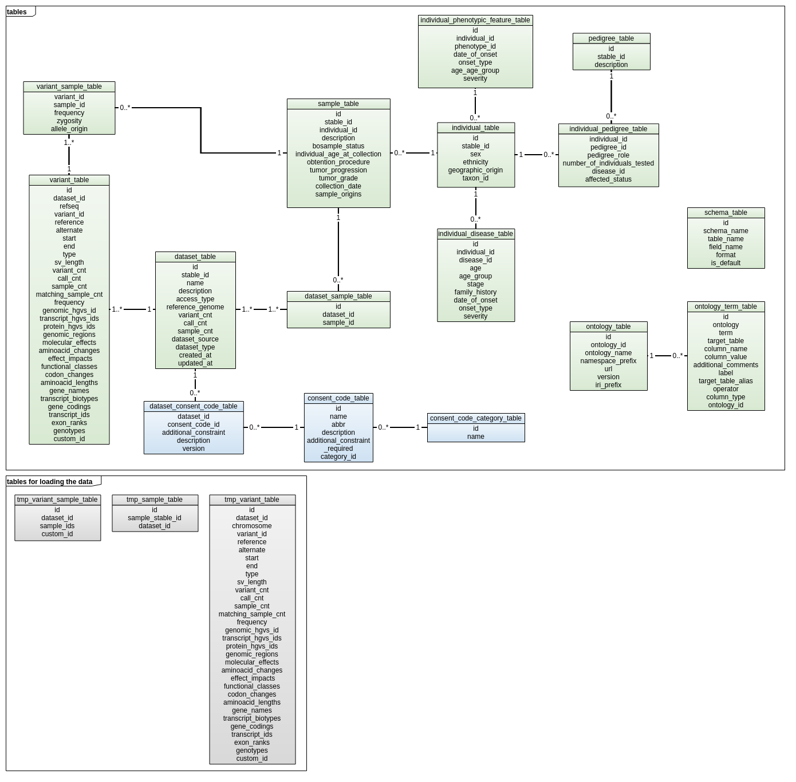

# Database structure

Here you can find a diagram of the database schema:

This schema also includes several functions which manage everything related to querying the data and are called from the Python code.  

These functions are:
* `query_gvariants`: queries the `variant_table`.
* `query_individuals`: queries the `individual_table`.
* `query_samples`: queries the `sample_table`.

There are also the following helper functions used by the previous ones:
* `add_where_clause_conditions`: prepares the conditions that will be in the `WHERE` clause.
* `find_format`: some fields are formatted as JSON by the main function. This function finds the schema which has to be used to build this JSON.  
* `parse_filters`: prepares the filters' values so they can be added to the query.
